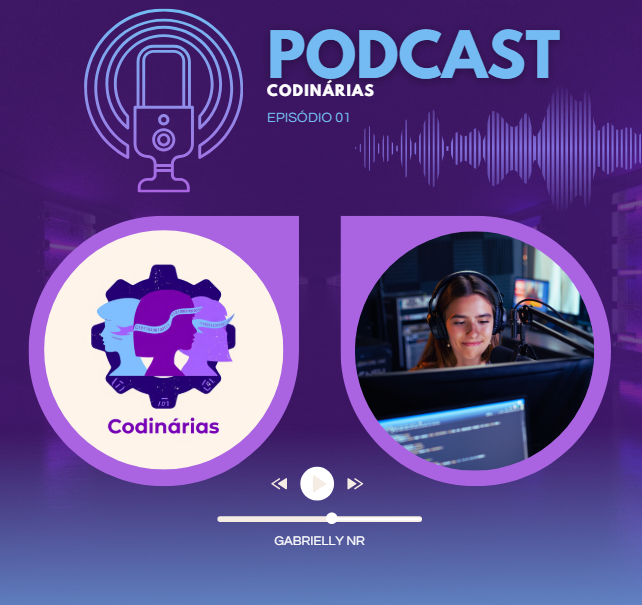

    preview do podcast

    <audio src="output/podcast_editado.MP3" controls title="Podcast editado"></audio>

# 🎙️ Projeto Codinárias Podcast com I.A.s

> 🌟 Este repositório foi criado com muito carinho durante o Bootcamp da [DIO](https://dio.me), unindo tecnologia, criatividade e voz feminina! 💜

O projeto tem como objetivo gerar um podcast de forma automatizada utilizando ferramentas de Inteligência Artificial, com foco em experiências femininas na tecnologia. 

## 💻 Tecnologias utilizadas

- [ChatGPT](https://chat.openai.com/) 
- [ReveAI](https://www.reveai.com/) *(gratuita!)*
- [ElevenLabs](https://beta.elevenlabs.io/)
- [Capcut](https://www.capcut.com/pt-br/)

## ✨ Como foi esse projeto?

- 💬 Roteiro gerado com prompts personalizados no ChatGPT  
- 🎤 Voz criada com ElevenLabs  
- 🎨 Capas/logos desenvolvidas no ReveAI  
- 🎧 Edição final no CapCut com trilhas leves.  

## 🚀 Como criar o seu PodCast?

1. 💡 Crie o roteiro no ChatGPT  
2. 🎙️ Gere o áudio com a voz no ElevenLabs  
3. 🎨 Crie uma capa maravilhosa no ReveAI  
4. 🎧 Edite tudo no CapCut  

## 👩‍💻 Feito com afeto por Gabrielly NR

---

    👩‍💻 Feito por  #73bbf2, #aa64e1 💖

